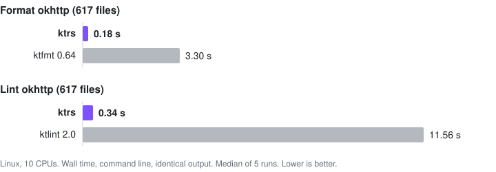

<div align="center">

# ktrs

**Kotlin formatting and linting in Rust, without starting a JVM.**

[](https://github.com/Hexay/ktrs/actions/workflows/ci.yml)
[](https://crates.io/crates/ktrs)
[](#license)
[](https://hexay.github.io/ktrs/)



</div>

ktrs is a native replacement for [ktfmt](https://github.com/facebook/ktfmt) and
[ktlint](https://github.com/pinterest/ktlint). It produces the same output, it is 7-190x faster, and
it ships as small native binaries with no runtime.

- ⚡ **Fast.** About 10 ms per file in an editor or pre-commit hook, against roughly a second of JVM
  startup. On whole projects it uses every core and is still at least 7x faster.
- 🎯 **Identical output.** Byte-identical to ktfmt 0.64 on 6,121 of 6,123 real-world files (both
  tools reject the other two). Lint violations and `--format` output match ktlint 2.0 in all three
  code styles.
- 🔌 **Drop-in.** The `ktfmt` and `ktlint` binaries accept the originals' flags, messages and exit
  codes, so existing scripts, hooks and CI keep working.
- 🧩 **Fits your setup.** Integrations for GitHub Actions, pre-commit, Spotless, a ktfmt-gradle
  drop-in plugin, and Neovim, Helix, Zed, Emacs and VS Code.
- 🌳 **Built on a faithful parser.** ktrs includes a lossless Kotlin parser whose tree matches the
  Kotlin compiler's PSI node for node.

Try the formatter in your browser in the **[playground](https://hexay.github.io/ktrs/)**, which runs
it as WebAssembly.

## Installation

```sh
curl -fsSL https://raw.githubusercontent.com/Hexay/ktrs/master/install.sh | sh   # prebuilt binaries
cargo install ktrs                                                                # from crates.io
brew tap hexay/ktrs https://github.com/Hexay/ktrs && brew install hexay/ktrs/ktrs  # Homebrew
```

One install puts three binaries on your PATH: `ktrs`, `ktfmt` and `ktlint`. The install script also
works on Windows under Git Bash; otherwise, download a zip from
[Releases](https://github.com/Hexay/ktrs/releases).

## Usage

```sh
ktrs fmt                              # format every .kt/.kts under the current directory
ktrs fmt --style kotlinlang src/      # styles: meta (default), google, kotlinlang
ktrs fmt --check                      # CI: list files that would change, exit 1 if any
ktrs fmt - < Foo.kt                   # stdin to stdout, for editors

ktrs lint                             # check every .kt/.kts under the current directory
ktrs lint --format src/               # autocorrect what can be fixed, report the rest
ktrs lint --reporter json - < Foo.kt  # reporters: plain, json, checkstyle, sarif, html, ...
```

### Drop-in for ktfmt and ktlint

The `ktfmt` and `ktlint` binaries accept the original command lines exactly, so anything that runs
the jars can run them instead:

```sh
ktfmt --kotlinlang-style --set-exit-if-changed src/
ktlint --relative "src/**/*.kt" "!src/**/generated/**"
```

- `ktfmt` supports all of ktfmt's flags, plus `@argfile`, `-` for stdin and `--enable-editorconfig`.
- `ktlint` supports `!` negation in patterns, `-F`, `--stdin`, `--patterns-from-stdin`, `--baseline`,
  `--editorconfig`, every built-in reporter, and the git hook subcommands.
- ktlint implements 2.0.0-ALPHA-4, with its engine and all 105 standard rules.

**Limits.**

- **ktlint 1.x.** ktrs matches ktlint 2.0, and 1.8 reports differ in a few rules. In
  `ktlint_official` and `intellij_idea` under 1% of violations differ. In `android_studio` about 5%
  differ, mostly in `argument-list-wrapping`, `function-literal` and `blank-line-before-declaration`.
  `--format` output differs on 2-22% of files, depending on the style. 2.0 also changed some exit
  codes and baseline matching. Details and causes are in
  [research/22](research/22-ktlint-1x-gap.md).
- **Custom rule sets.** JVM rule sets and reporters (`-R`, `artifact=`) can't be loaded. Run the
  ktlint jar for those.

## Integrations

### GitHub Actions

```yaml
- uses: Hexay/ktrs@v0.3.1          # Linux, macOS and Windows
- run: ktrs fmt --check --style kotlinlang
- run: ktrs lint
```

### pre-commit

No Rust needed: on first run, the hook downloads the release binaries for its `rev`.

```yaml
- repo: https://github.com/Hexay/ktrs
  rev: v0.3.1
  hooks:
    - id: ktrs-fmt          # also: ktrs-fmt-check, ktfmt (with ktfmt's flags in `args`)
      args: [--style, kotlinlang]
    - id: ktrs-lint         # also: ktrs-lint-format, ktlint (with ktlint's flags in `args`)
```

### Editors

Editors pass the buffer on stdin. `--stdin-name` gives ktrs the file's path so `.editorconfig`
applies. Add `--style google` or `--style kotlinlang` if you need them.

<details>
<summary><b>Neovim</b> (conform.nvim), <b>Helix</b>, <b>Zed</b>, <b>Emacs</b> (apheleia), <b>VS Code</b></summary>

**Neovim** ([conform.nvim](https://github.com/stevearc/conform.nvim)):

```lua
formatters_by_ft = { kotlin = { "ktrs" } },
formatters = { ktrs = { command = "ktrs", args = { "fmt", "--editorconfig", "--stdin-name", "$FILENAME", "-" } } },
```

**Helix** (`languages.toml`):

```toml
[[language]]
name = "kotlin"
formatter = { command = "ktrs", args = ["fmt", "-"] }
auto-format = true
```

**Zed** (`settings.json`):

```json
"languages": { "Kotlin": { "formatter": { "external": {
  "command": "ktrs", "arguments": ["fmt", "--editorconfig", "--stdin-name", "{buffer_path}", "-"] } } } }
```

**Emacs** ([apheleia](https://github.com/radian-software/apheleia)):

```elisp
(push '(ktrs . ("ktrs" "fmt" "--editorconfig" "--stdin-name" filepath "-")) apheleia-formatters)
(setf (alist-get 'kotlin-mode apheleia-mode-alist) 'ktrs)
```

**VS Code** ([Custom Local Formatters](https://marketplace.visualstudio.com/items?itemName=jkillian.custom-local-formatters)):

```json
"customLocalFormatters.formatters": [
  { "command": "ktrs fmt --editorconfig --stdin-name \"${file}\" -", "languages": ["kotlin"] } ]
```

</details>

### Gradle

**ktfmt-gradle drop-in.** The `io.github.hexay.ktrs` plugin replaces
[ktfmt-gradle](https://github.com/cortinico/ktfmt-gradle) 0.27.0. Change only the plugin id. The
`ktfmt { }` block, the `ktfmtCheck`/`ktfmtFormat*` tasks, `--include-only` and the
`com.ncorti.ktfmt.gradle.*` imports keep working.

```kotlin
plugins {
    id("io.github.hexay.ktrs") version "0.3.1"   // was: id("com.ncorti.ktfmt.gradle") version "0.27.0"
}
```

**Spotless.** `KtrsStep` replaces `ktfmt()` (Spotless 7+):

```kotlin
buildscript {
    repositories { maven("https://hexay.github.io/ktrs/maven") }
    dependencies { classpath("io.github.hexay:ktrs:0.3.1") }
}

spotless {
    kotlin {
        addStep(io.github.hexay.ktrs.spotless.KtrsStep.create(io.github.hexay.ktrs.KtrsOptions.kotlinlang()))
    }
}
```

<details>
<summary>Plugin repository, JVM API and options</summary>

Until the plugin is on the Gradle Plugin Portal, add the repository in `settings.gradle.kts`:

```kotlin
pluginManagement {
    repositories {
        gradlePluginPortal()
        maven("https://hexay.github.io/ktrs/maven")
    }
}
```

The `io.github.hexay:ktrs` jar has no dependencies. It bundles the native binaries for Linux, macOS
and Windows (x86-64 and ARM) and keeps long-lived `ktrs serve` processes, so a build starts the
binary once, not once per file.

- `KtrsOptions` mirrors ktfmt's options: start from `meta()`, `google()` or `kotlinlang()`, then
  chain `withMaxWidth`, `withBlockIndent`, `withContinuationIndent`, `withRemoveUnusedImports`,
  `withTrailingCommas` and `withEditorConfig(true)`.
- From other JVM code, `Ktrs.create()` returns a thread-safe formatter:
  `ktrs.format(code, KtrsOptions.google())`.
- The plugin accepts `useClassloaderIsolation`, `processIsolationJvmArgs` and `ktfmtClasspath` but
  ignores them. `debuggingPrintOpsAfterFormatting` only logs a warning.
- To use a different binary from the bundled one, set the Gradle property `ktrs.executable`.
- Without the jar, Spotless's generic step runs the binary once per file:
  `nativeCmd("ktfmt", "/path/to/ktfmt", listOf("--kotlinlang-style", "-"))`.

</details>

## Performance

Each tool is run from the command line the way users run it: same flags, same files, identical
output. Timings are wall time, the median of 5 alternating runs after a warm-up.

**Formatting** compares the `ktfmt` binary with the ktfmt 0.64 jar on a Windows 11 laptop (Intel Core
Ultra, 22 threads, JDK 21):

| Scenario | ktrs | ktfmt 0.64 | Speedup |
|---|--:|--:|--:|
| Editor: one 8 KB file on stdin | 16 ms | 1.49 s | **96x** |
| Pre-commit: 10 changed files | 26 ms | 2.57 s | **99x** |
| CI check on okhttp (617 files) | 316 ms | 9.08 s | **29x** |
| Format okhttp in place | 465 ms | 9.58 s | **21x** |
| Format okhttp in place, 1 core | 1.48 s | 40.79 s | **28x** |
| Format 7 projects (6,123 files, 31 MB) | 3.69 s | 24.55 s | **7x** |

**Linting** compares the `ktlint` binary with the ktlint 2.0.0-ALPHA-4 jar on Linux (Xeon E-2136, 10
CPUs, JDK 21):

| Scenario | ktrs | ktlint 2.0 | Speedup |
|---|--:|--:|--:|
| Editor: one 8 KB file on stdin | <10 ms | 1.04 s | **>100x** |
| Lint one file | <10 ms | 830 ms | **>80x** |
| Lint okhttp (617 files) | 390 ms | 11.33 s | **29x** |
| Autocorrect okhttp (`-F`) | 620 ms | 118.94 s | **192x** |
| Lint okhttp, 1 core | 1.35 s · 47 MB | 38.15 s · 344 MB | **28x** |
| Lint 7 projects (6,123 files) | 1.79 s · 249 MB | 48.24 s · 515 MB | **27x** |
| Autocorrect 7 projects (`-F`) | 3.76 s | 320.12 s | **85x** |

JVM startup dominates small runs. On large runs ktrs is still several times faster per core, and it
uses every core. The binary is a few MB with no runtime, compared with a 71 MB jar plus a JRE.

<details>
<summary>Methodology and Spotless numbers</summary>

- **Corpus.** The 7 projects are okhttp, kotlinx.coroutines, nowinandroid, ktlint, ktfmt, Exposed
  and ktor, pinned in `corpus/REVISIONS` and fetched by `tools/fetch-corpus.sh`.
- **1 core.** Both processes are pinned to one CPU from launch. The JVM then sizes its GC and JIT
  threads for one CPU, as it would in a 1-CPU container, and its JIT competes with the work.
- **Identical output.** ktfmt rejects 2 of the 6,123 files, Exposed's `{{packageName}}`
  code-generator templates, and ktrs rejects them with the same error.
- **Reproduce.** Formatting: `py -3 tools/bench/e2e.py`. Linting: `tools/bench/lint-e2e.sh`, with
  results and the comparison against ktlint 1.8 and ktlint-rs in
  [research/20](research/20-ktlint-bench.md).

**Spotless.** `spotlessApply` on okhttp's 573 files gives identical output. The figures are the
formatter's share, after subtracting a Spotless run that only trims whitespace:

| Spotless step | ktrs (`KtrsStep`) | ktfmt 0.64 (`ktfmt()`) |
|---|--:|--:|
| Fresh Gradle daemon, as in CI | ~4 s | ~52 s |
| Warm daemon, repeated runs | ~2 s | ~6 s |

</details>

## How correctness is checked

Parity with the original tools is the spec. The ported test suites run in CI, and the corpus diffs
(`cargo corpus-diff`, `cargo fmt-diff`, `cargo lint-diff`) compare against the real tools on ~6,000
files:

- **Parser.** The tree must match the Kotlin compiler's PSI (`DebugUtil.psiToString`) on the
  compiler's own test fixtures and on every corpus file.
- **Formatter.** ktfmt's test suite is ported. The output is also diffed byte for byte against the
  ktfmt jar on the corpus in the meta, google and kotlinlang styles.
- **Linter.** ktlint's rule tests are ported. Violations and `--format` output are diffed against
  the ktlint jar on the corpus in the `ktlint_official`, `intellij_idea` and `android_studio` code
  styles, with and without experimental rules.
- **CLIs.** The `ktfmt` and `ktlint` binaries are compared with the jars on stdout, stderr, exit
  code and written files across a scenario suite.
- **Held-out corpus.** To check that the corpus work didn't overfit, the CLIs also run against a
  second corpus that never drove a fix. It has 15,287 files from 20 other projects, pinned in
  [`tools/holdout/REVISIONS`](tools/holdout/REVISIONS). In the first run:
  - All 2.2M lint violations matched ktlint in all three styles.
  - ktfmt output matched on every file in all three styles.
  - `--format` output differed on 3 files, from one rule. That bug is now fixed.

  Details are in [research/21](research/21-holdout.md); `tools/holdout/run.sh` reruns it.
- **Upstream releases.** A weekly workflow opens an issue when ktfmt, ktlint or Kotlin publishes a
  release newer than the pinned version.

## Maintenance

ktrs is maintained by [@Hexay](https://github.com/Hexay). It tracks ktfmt 0.64, ktlint
2.0.0-ALPHA-4 and the Kotlin 2.4.20 parser. New upstream releases are ported and re-checked against
the parity gates before a ktrs release. If ktrs output ever differs from ktfmt or ktlint on your
code, that's a bug: please [open an issue](https://github.com/Hexay/ktrs/issues) with the file, or
a snippet that reproduces it, and the command line you used.

## Contributing

```sh
tools/sync-kotlin.sh                  # pinned upstream sources + vendored test fixtures
tools/psi-dump/psi-dump.sh one X.kt   # reference PSI tree from the real compiler (needs a JDK)
cargo xtask codegen                   # regenerate SyntaxKind from crates/ktrs-syntax/kinds.tsv
cargo test
```

[`CLAUDE.md`](CLAUDE.md) lists the crate layout and every parity gate. Design notes are in
[`research/`](research/).

## License

Dual-licensed under [MIT](LICENSE-MIT) or [Apache-2.0](LICENSE-APACHE), at your option. ktrs
contains code and test data ported from the Kotlin compiler, the IntelliJ Platform, ktfmt,
google-java-format, ec4j (Apache-2.0), ktlint and ktfmt-gradle (MIT). See [NOTICE](NOTICE).
